# NgenOrca Enterprise Architecture Diagrams

This document provides a complete enterprise architecture view of NgenOrca using:

- **TOGAF-style architecture domains** (Business, Application, Data, Technology)
- **Cross-cutting Security and Governance views**
- **Alternative viewpoints** (C4-style and ArchiMate-style layering)

Use this as a canonical architecture reference for security review, platform planning, and audit readiness.

---

## 1) TOGAF Functional View (Business + Capability)

### 1.1 Business Capability Map

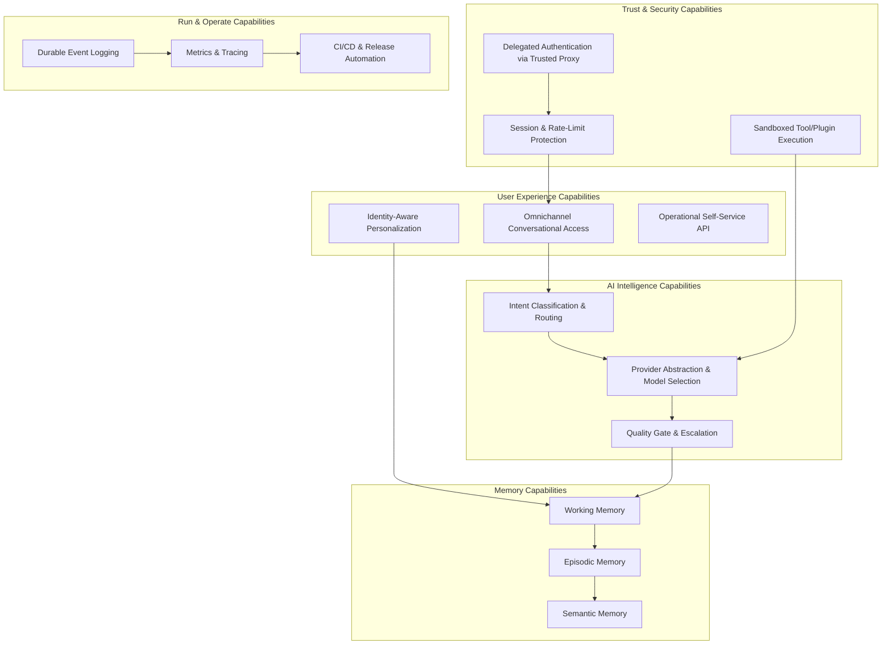

### 1.2 Business Interaction / Value Stream (Request to Response)

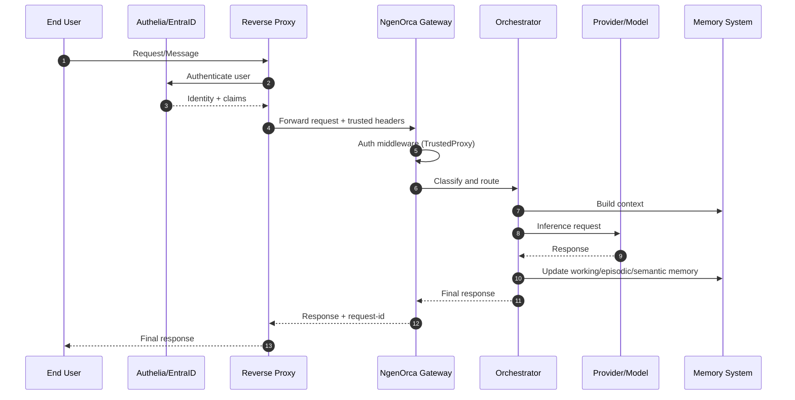

---

## 2) TOGAF Application Architecture View

### 2.1 Application Component Diagram

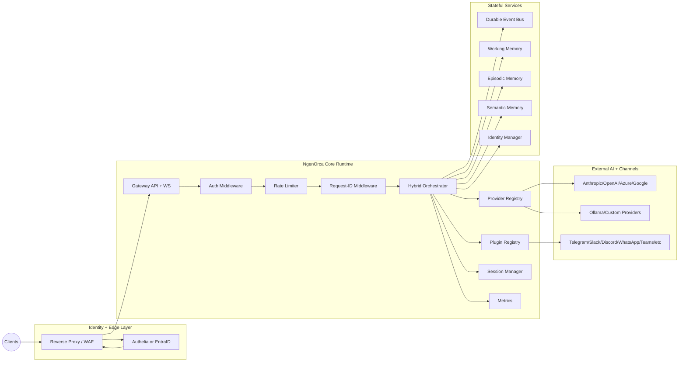

### 2.2 Functional Service Boundaries

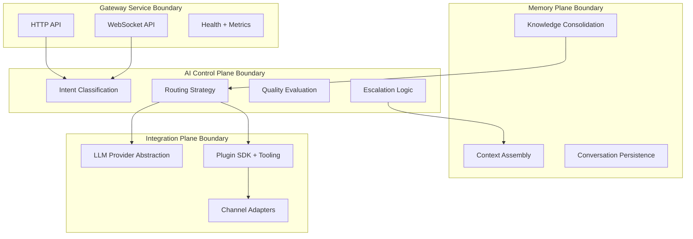

---

## 3) TOGAF Data Architecture View

### 3.1 Conceptual Data Model

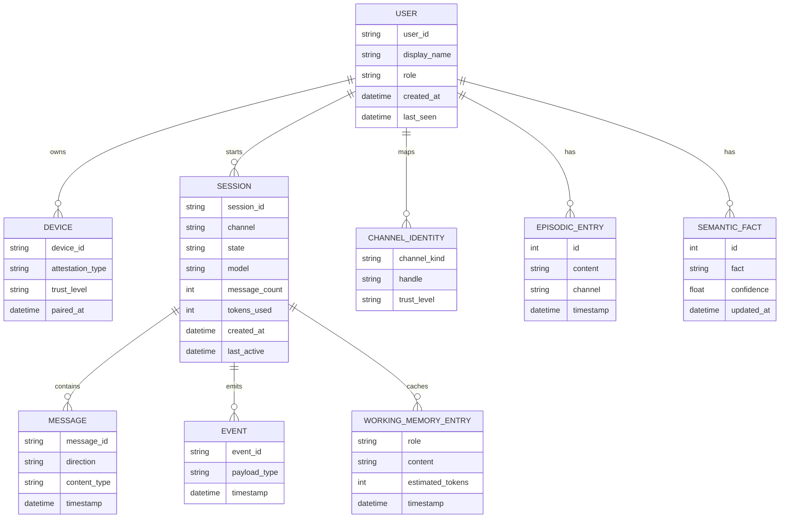

### 3.2 Data Lifecycle and Retention

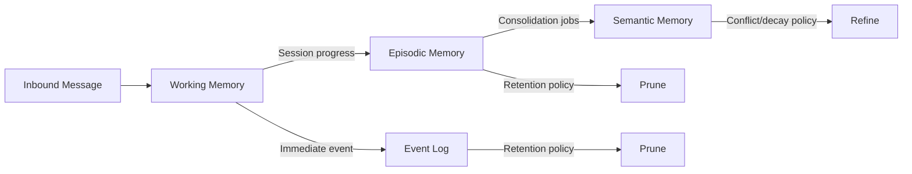

---

## 4) TOGAF Technology Architecture View

### 4.1 Runtime and Infrastructure Topology

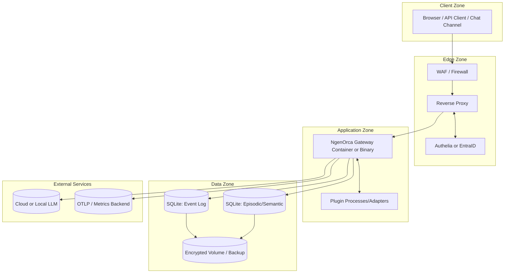

### 4.2 Network Trust Boundaries (Direct Access Rejection)

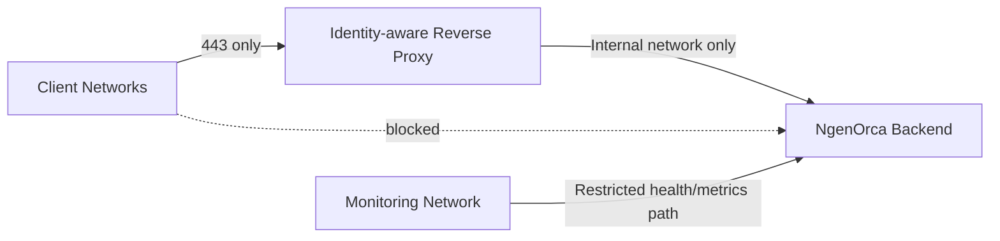

---

## 5) Security Architecture View (Cross-cutting)

### 5.1 Control Layering

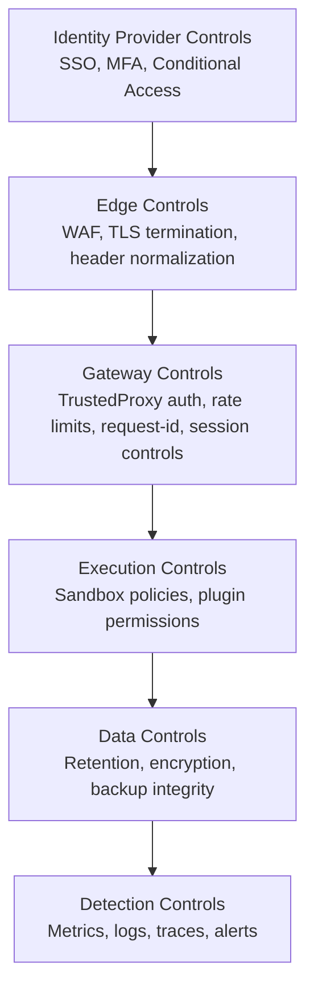

### 5.2 Threat-to-Control Mapping (Simplified)

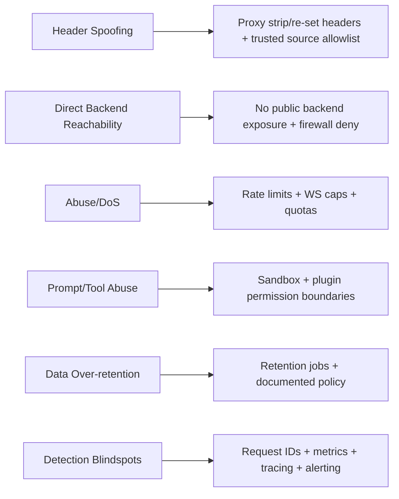

---

## 6) Alternative Enterprise Architecture Views

## 6.1 C4-Style Context and Container Views

### C4 Level 1 (System Context)

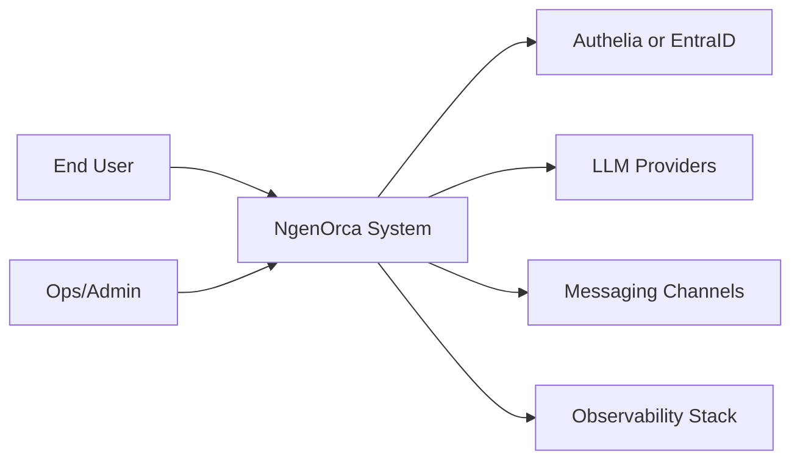

### C4 Level 2 (Container)

```mermaid
flowchart TB
  subgraph NgenOrcaSystem[NgenOrca]
    C1[Gateway Container]
    C2[Memory/Identity Stores (SQLite)]
    C3[Plugin Runtime]
  end
  IdP[Authelia or EntraID]
  Proxy[Reverse Proxy]
  LLM[LLM Provider(s)]
  User[Client]

  User --> Proxy
  Proxy <--> IdP
  Proxy --> C1
  C1 --> C2
  C1 --> C3
  C1 --> LLM
```

## 6.2 ArchiMate-Style Layered View (Conceptual)

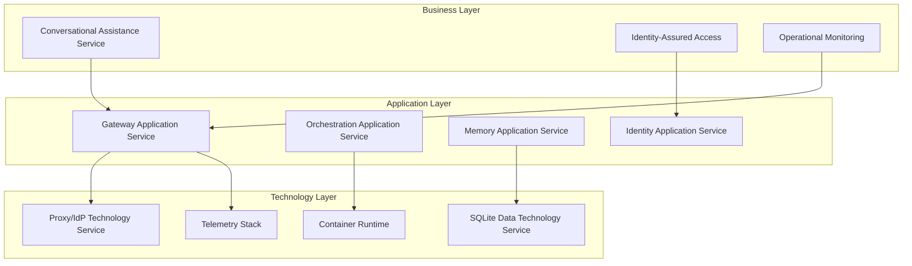

---

## 7) TOGAF to Alternative Mapping

| TOGAF Domain | Primary Diagram(s) in this doc | C4 Equivalent | ArchiMate Equivalent |
|---|---|---|---|
| Business Architecture | 1.1, 1.2 | Context + user goals | Business Services/Processes |
| Application Architecture | 2.1, 2.2 | Container/Component | Application Services/Functions |
| Data Architecture | 3.1, 3.2 | Container data relationships | Data Objects and Flows |
| Technology Architecture | 4.1, 4.2 | Deployment and infra context | Technology Services/Nodes |
| Security (cross-cutting) | 5.1, 5.2 | Threat overlays | Motivation/Constraint overlays |

---

## 8) Implementation and Migration View (Roadmap)

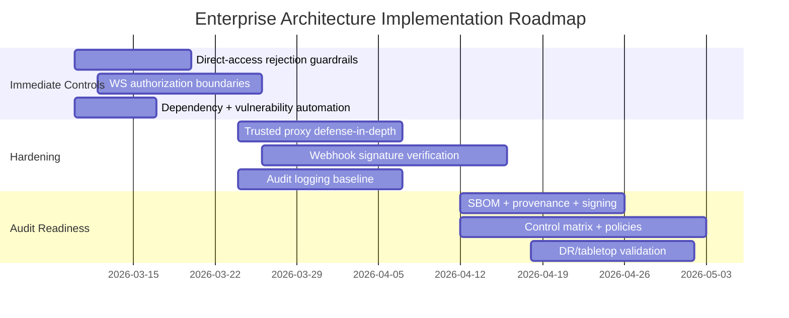

---

## 9) Notes for Architecture Review Board

- **Enterprise default posture:** `TrustedProxy` with no direct backend exposure.
- **Functional emphasis:** Orchestration quality + memory continuity across channels.
- **Technical emphasis:** strict trust boundaries, observability, and release integrity.
- **Decision checkpoints:** identity boundary enforcement, event visibility boundaries, and supply-chain attestation.
